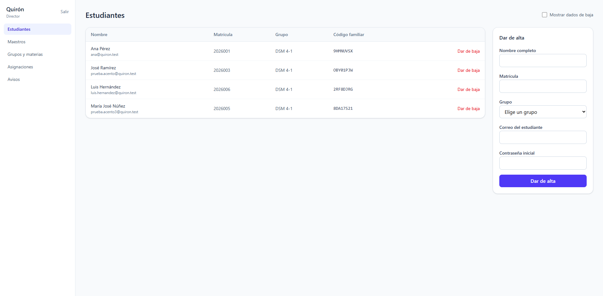
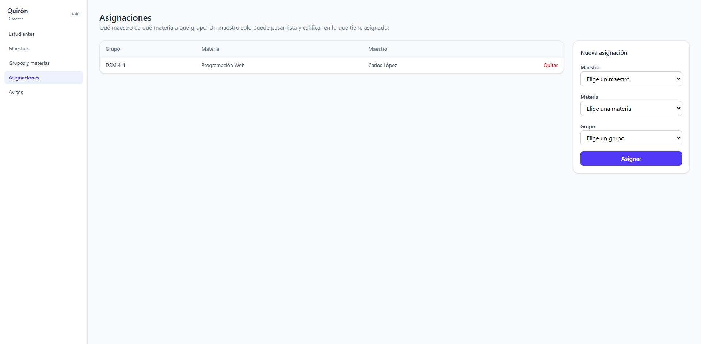
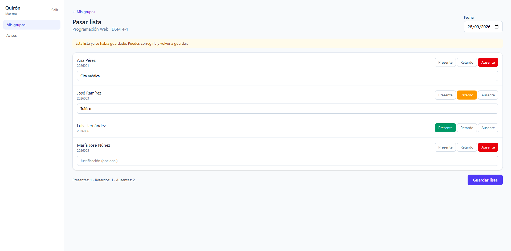
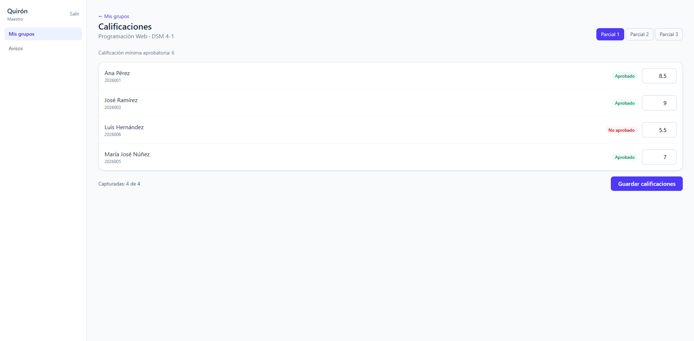
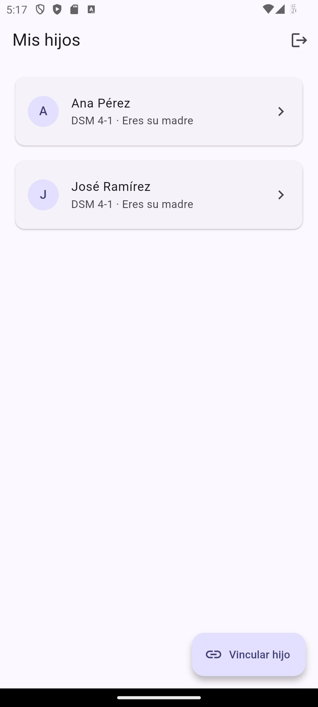
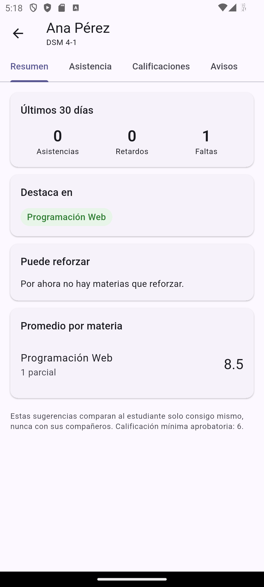
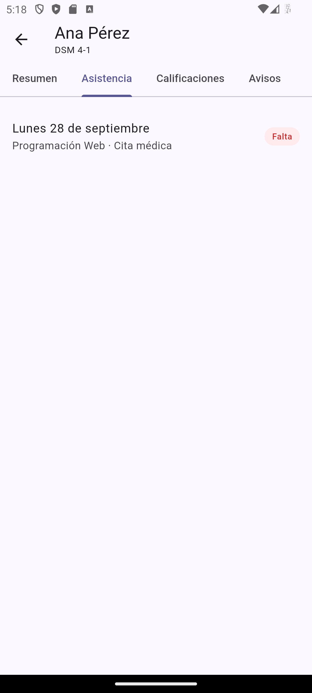
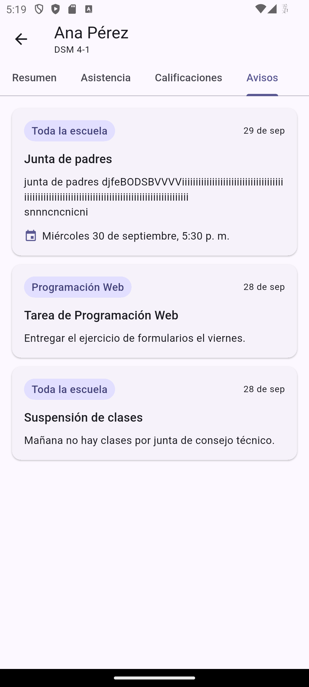

# Proyecto Quirón

[](https://github.com/felixarvizuangel/proyecto-quiron/actions/workflows/pruebas.yml)

> El guía que acompaña al estudiante y a su familia.

Quirón es una plataforma escolar que conecta a la escuela con las familias. Los maestros pasan lista, capturan calificaciones y publican avisos desde un panel web, y los padres, madres y tutores ven el progreso de sus hijos en una app móvil.

La idea central: la app no solo muestra números. Le dice a la familia en qué destaca el estudiante y qué puede reforzar, comparándolo solo consigo mismo y nunca con sus compañeros.

**Pruébalo:** [Panel web](https://quiron-panel.onrender.com) · [App para Android](https://github.com/felixarvizuangel/proyecto-quiron/releases/latest) · [Estado de la API](https://quiron-api.onrender.com/salud)

---

## Tabla de contenido
1. [Pruébalo](#pruébalo)
2. [Problema que resuelve](#problema-que-resuelve)
3. [Capturas](#capturas)
4. [Roles y permisos](#roles-y-permisos)
5. [Funciones principales](#funciones-principales)
6. [Panel web](#panel-web)
7. [App para familias](#app-para-familias)
8. [Base de datos](#base-de-datos)
9. [Stack tecnológico](#stack-tecnológico)
10. [Arquitectura y despliegue](#arquitectura-y-despliegue)
11. [Estructura del repositorio](#estructura-del-repositorio)
12. [Cómo ejecutar el proyecto](#cómo-ejecutar-el-proyecto)
13. [Pruebas automatizadas](#pruebas-automatizadas)
14. [Configuración](#configuración)
15. [Escuelas que califican de 0 a 100](#escuelas-que-califican-de-0-a-100)
16. [API](#api)
17. [Roadmap](#roadmap)
18. [Decisiones de diseño](#decisiones-de-diseño)
19. [Consideraciones de escalabilidad](#consideraciones-de-escalabilidad)
20. [Estado actual](#estado-actual)
21. [Autor](#autor)

---

## Pruébalo
Quirón está publicado con una escuela de demostración.

| Qué | Dónde |
|---|---|
| Panel web (Director y maestros) | https://quiron-panel.onrender.com |
| App para familias (Android) | Descarga el APK en [Releases](https://github.com/felixarvizuangel/proyecto-quiron/releases/latest) |
| API | https://quiron-api.onrender.com/salud |

**Cuentas de demostración.** Todas usan la contraseña `QuironDemo2026`.

| Rol | Correo | Dónde entrar | Qué puedes ver |
|---|---|---|---|
| Director | `director@quiron-demo.test` | Panel | Estudiantes, maestros, asignaciones y avisos de toda la escuela |
| Maestra | `maestra.mendez@quiron-demo.test` | Panel | Matemáticas en 1° A y 1° B: pasar lista, calificar y publicar avisos |
| Maestro | `maestro.salazar@quiron-demo.test` | Panel | Español en 1° A y Ciencias en 1° B |
| Familia | `familia.ramirez@quiron-demo.test` | App | Dos hijos: Sofía, que destaca en sus materias, y Mateo, que puede reforzar Ciencias |
| Familia | `familia.torres@quiron-demo.test` | App | Un hijo: Diego |

**Para probar la vinculación:** en la app, crea tu propia cuenta de familia con *Crear cuenta*, toca **Vincular hijo** y usa el código `W8E2JU5A` (Camila Flores).

**A tomar en cuenta:**
- Todos los datos son ficticios. Los correos usan el dominio reservado `.test`, que no puede pertenecer a nadie.
- La demo usa planes gratuitos: la API se duerme después de 15 minutos sin uso, así que la primera petición puede tardar cerca de un minuto.
- La demo es compartida: otras personas pueden haber hecho cambios. Se restaura con `npm run demo -- --confirmar`.
- El APK no está en Google Play. Para instalarlo, descárgalo en el celular y permite instalar apps de origen desconocido.

## Problema que resuelve
En muchas escuelas la información del estudiante (asistencia, calificaciones, avisos) llega tarde a los padres o por medios dispersos. Quirón centraliza todo en un solo sistema: el maestro registra una vez y la familia lo ve de inmediato en su celular.

## Capturas
Todas las capturas usan datos de prueba.

### Panel web (Director y maestros)
| Estudiantes (Director) | Asignaciones (Director) |
|---|---|
|  |  |
| **Pasar lista (Maestro)** | **Calificaciones (Maestro)** |
|  |  |

### App para familias
<p>
  
  
  
  
</p>

## Roles y permisos

| Acción | Director | Maestro | Estudiante | Padre/Tutor |
|---|---|---|---|---|
| Dar de alta y baja a maestros y alumnos | Sí | No | No | No |
| Ver información de toda la escuela | Sí | No | No | No |
| Pasar lista y capturar calificaciones | No | Sí (solo sus grupos y materias) | No | No |
| Publicar avisos | Sí (generales) | Sí (solo su grupo y materia) | No | No |
| Ver calificaciones y asistencia | Sí (todos) | Sí (solo su grupo) | Solo las propias | Solo las de sus hijos |
| Vincularse con un estudiante | No | No | No | Sí, con el código familiar |
| Comparar entre estudiantes o hijos | No aplica | No aplica | No | No (decisión de producto) |

Los permisos se validan en el servidor, no solo en la interfaz. Las reglas de acceso viven en un solo módulo (`backend/src/auth/permisos.ts`), y cualquier rol sin una regla definida no ve nada.

## Funciones principales
- **Pase de lista por grupo:** presente, retardo o ausente, con justificación opcional. Se puede corregir un día anterior.
- **Calificaciones por parcial.** El estado aprobado/reprobado se calcula al consultar, no se guarda.
- **Avisos** generales del Director, o por grupo y materia de cada maestro, con fecha de evento opcional.
- **Altas y bajas:** el Director da de alta a estudiantes y maestros, y puede darlos de baja o reactivarlos sin perder su historial. La baja surte efecto al instante.
- **Vinculación con código familiar:** la familia escribe el código de 8 caracteres que le da la escuela y queda ligada a su hijo como padre, madre o tutor.
- **App para familias** con un menú por hijo, sin comparaciones, con su resumen, asistencia, calificaciones y avisos.
- **Acompañamiento, primera versión:** "Destaca en" y "Puede reforzar", calculados comparando al estudiante solo consigo mismo. En la Fase 2 los validará un orientador.
- **Notificaciones push**, incluyendo alertas urgentes con sonido distinto (planeado).

## Panel web
El panel es solo para el Director y los maestros.

| Rol | Pantalla | Qué hace |
|---|---|---|
| Director | Estudiantes | Lista, alta con código familiar, baja y reactivación |
| Director | Maestros | Lista, alta, baja y reactivación |
| Director | Grupos y materias | Catálogos de la escuela |
| Director | Asignaciones | Qué maestro da qué materia a qué grupo: asignar y quitar |
| Director | Avisos | Todos los avisos; publica avisos para toda la escuela |
| Maestro | Mis grupos | Materias y grupos que tiene asignados |
| Maestro | Pasar lista | Todo el grupo en una pantalla, por fecha; todos empiezan como presentes |
| Maestro | Calificaciones | Captura por parcial, con aprobado/no aprobado mientras se escribe |
| Maestro | Avisos | Avisos generales y propios; publica en sus grupos |

Cada rol solo tiene registradas sus propias pantallas, y la sesión se cierra sola si el token vence o si la cuenta se da de baja.

## App para familias
La app es solo para padres, madres y tutores. Si alguien del personal intenta entrar, se le indica que use el panel web. El APK de cada versión se publica en [Releases](https://github.com/felixarvizuangel/proyecto-quiron/releases).

| Pantalla | Qué hace |
|---|---|
| Entrar y Crear cuenta | Acceso y registro de familias |
| Mis hijos | Lista de hijos vinculados; jalar hacia abajo la actualiza |
| Vincular hijo | Código familiar de 8 caracteres y relación (madre, padre o tutor) |
| Resumen | Asistencia de los últimos 30 días, "Destaca en", "Puede reforzar" y promedio por materia |
| Asistencia | Cada registro con fecha, materia, estado y justificación |
| Calificaciones | Agrupadas por parcial, como una boleta |
| Avisos | Generales y de sus materias, con la fecha del evento |

**Cómo se calcula el acompañamiento:** "Destaca en" muestra hasta dos materias en la mitad alta del rango aprobatorio (con mínima 6, un promedio de 8 o más). "Puede reforzar" muestra las materias con promedio por debajo de la mínima. El estudiante solo se compara consigo mismo, y la app lo explica al pie del resumen.

La sesión se guarda cifrada en el teléfono. Si el token vence, la app regresa sola al login.

## Base de datos
Diseño relacional de 11 tablas en PostgreSQL. Las relaciones de muchos a muchos se resuelven con tablas intermedias y los datos de acceso viven en una sola tabla (`Usuarios`).


| Tabla | Propósito |
|---|---|
| `Usuarios` | Correo, contraseña cifrada, rol y estado (activo) de todas las personas |
| `Estudiantes` | Datos del alumno, su grupo y su código familiar |
| `Padres` | Padres, madres y tutores |
| `Estudiante_Padre` | Vincula alumnos con sus tutores y guarda la relación (padre, madre o tutor) |
| `Maestros` | Datos del personal docente |
| `Materias` | Catálogo de materias |
| `Grupos` | Grupos y grados |
| `Materia_Maestro_Grupo` | Qué maestro da qué materia a qué grupo |
| `Asistencia` | Registro por estudiante, materia y fecha |
| `Calificaciones` | Nota por estudiante, materia, maestro y parcial |
| `Avisos` | Comunicados generales o por grupo |

El esquema completo está en [`backend/db/schema.sql`](backend/db/schema.sql).

## Stack tecnológico

| Capa | Tecnología |
|---|---|
| API | Node.js 24 LTS, TypeScript, Express |
| Base de datos | PostgreSQL 18 (Docker en desarrollo, Neon en la nube) |
| Contenedores | Docker |
| Autenticación | JWT + argon2 para cifrar contraseñas |
| Validación de datos | Zod |
| Autorización | Control de roles propio, verificado en cada ruta |
| Protección de la API | express-rate-limit (límite de intentos) y cors (sitios permitidos) |
| Panel web (Director y Maestro) | React, Vite 8, Tailwind CSS 4, React Router |
| App móvil (Familias) | Flutter (Dart), http, flutter_secure_storage, intl |
| Pruebas | Vitest + Supertest |
| Integración continua | GitHub Actions |
| Publicación | Render (API y panel), Neon (PostgreSQL), GitHub Releases (APK) |
| Notificaciones push | Firebase Cloud Messaging (planeado) |

## Arquitectura y despliegue
Las tres partes se comunican solo por la API, siempre con `https`:

```
App para familias (Android) ──┐
                              ├──►  API · Render  ──►  PostgreSQL · Neon
Panel web · Render (estático) ┘     (web service)      (conexión cifrada)
```

| Pieza | Dónde se publica | Detalles |
|---|---|---|
| Base de datos | Neon, plan gratuito, región Oregon | PostgreSQL gestionado. No caduca; se suspende tras unos minutos sin uso y despierta con la siguiente consulta |
| API | Render, web service gratuito, región Oregon | Compila con `npm ci && npm run build`, arranca con `npm start` y Render revisa `/salud` antes de publicarla. Se duerme tras 15 minutos sin visitas |
| Panel web | Render, sitio estático | Se sirve ya compilado y no se duerme. La regla `/*` → `/index.html` permite recargar cualquier pantalla |
| App | GitHub Releases | APK compilado con la dirección de la API publicada |

Cada push a `main` pasa por GitHub Actions, y Render vuelve a publicar la API y el panel con los cambios.

**Cómo publicar tu propia copia**
1. **Base de datos:** crea un proyecto en Neon y copia su dirección de conexión, cambiando `sslmode=require` por `sslmode=verify-full`.
2. **Tablas y datos:** en la terminal, dentro de `backend`, define `DATABASE_URL` con esa dirección y ejecuta `npm run demo -- --confirmar` (escuela de demostración) o `npm run esquema` (tablas vacías para una escuela real).
3. **API:** en Render, crea un *Web Service* con Root Directory `backend`, Build Command `npm ci && npm run build`, Start Command `npm start`, Health Check Path `/salud`, y las variables de [Configuración](#configuración).
4. **Panel:** crea un *Static Site* con Root Directory `web`, Build Command `npm ci && npm run build`, Publish Directory `dist`, la variable `VITE_API_URL` y la regla de reescritura `/*` → `/index.html`.
5. **Permitir el panel:** en la API, agrega `CORS_ORIGEN` con la dirección del panel.
6. **App:** `flutter build apk --release --dart-define=API_URL=https://tu-api.onrender.com`.

Las contraseñas y secretos viven solo en la configuración de Render, nunca en el repositorio.

## Estructura del repositorio
```
proyecto-quiron/
├── .github/workflows/
│   └── pruebas.yml           Integración continua: API, panel y app en cada push
├── backend/
│   ├── db/schema.sql         Esquema de la base de datos
│   ├── src/
│   │   ├── auth/             Registro, login, JWT, reglas de acceso y límite de intentos
│   │   ├── estudiantes/      Lista, alta, baja y reactivación de estudiantes
│   │   ├── maestros/         Lista, alta, baja y reactivación de maestros
│   │   ├── materias/         Catálogo de materias
│   │   ├── grupos/           Catálogo de grupos
│   │   ├── asignaciones/     Qué maestro da qué materia a qué grupo
│   │   ├── asistencia/       Pase de lista por grupo y consultas
│   │   ├── calificaciones/   Captura por parcial y consultas
│   │   ├── avisos/           Publicación, consulta y borrado de avisos
│   │   ├── familia/          Vinculación, hijos y resumen para familias
│   │   ├── scripts/          Cuenta del Director, esquema y escuela de demostración
│   │   ├── app.ts            Rutas, CORS y proxy
│   │   ├── config.ts         Variables de entorno (en tu computadora y en la nube)
│   │   ├── db.ts             Conexión a PostgreSQL
│   │   └── server.ts         Arranque del servidor
│   ├── test/                 Pruebas automatizadas
│   └── vitest.config.ts      Configuración de las pruebas
├── web/
│   └── src/
│       ├── componentes/      Menú lateral y piezas de formulario
│       ├── paginas/          Una pantalla por archivo (login, estudiantes, avisos, etc.)
│       ├── api.ts            Todas las llamadas a la API
│       ├── sesion.tsx        Sesión y rol del usuario
│       ├── useApi.ts         Carga de datos con estado de carga y error
│       └── App.tsx           Rutas según el rol
├── mobile/
│   └── lib/
│       ├── api/              Cliente de la API y sesión guardada de forma segura
│       ├── modelos/          Hijo, resumen, asistencia, calificaciones y avisos
│       ├── pantallas/        Login, registro, mis hijos, vincular y detalle del hijo
│       ├── utilidades/       Fechas y números en español de México
│       ├── widgets/          Piezas compartidas (carga de datos, mensajes de error)
│       └── main.dart         Arranque, tema y regreso al login si la sesión termina
├── docs/                     Diagrama ER y capturas
├── docker-compose.yml        PostgreSQL en Docker
├── .env.example              Variables de entorno de ejemplo
└── README.md
```

## Cómo ejecutar el proyecto
Requisitos: Docker Desktop, Node.js 24 LTS y, para la app, Flutter con un emulador de Android. Los comandos son para PowerShell.

**La primera vez**
1. Copia la configuración de ejemplo y cambia la contraseña de la base y el secreto JWT:
```
   Copy-Item .env.example .env
```
2. Levanta PostgreSQL:
```
   docker compose up -d
```
3. Crea las tablas:
```
   Get-Content backend\db\schema.sql -Raw -Encoding UTF8 | docker exec -i quiron-db psql -U quiron_admin -d quiron
```
4. Instala las dependencias y crea la cuenta del Director:
```
   cd backend
   npm install
   npm run crear-director -- director@escuela.mx "una-clave-segura"
   cd ..\web
   npm install
   cd ..\mobile
   flutter pub get
```

**Cada vez que trabajes**
1. Abre Docker Desktop y, en la raíz, ejecuta `docker compose up -d`.
2. Terminal 1 (API): `cd backend` y `npm run dev`. Queda en http://localhost:3000
3. Terminal 2 (panel): `cd web` y `npm run dev`. Queda en http://localhost:5173
4. Terminal 3 (app): enciende el emulador con `flutter emulators --launch <id>`, luego `cd mobile` y `flutter run`.

**Scripts de la API** (dentro de `backend`)

| Comando | Qué hace |
|---|---|
| `npm run dev` | API con recarga automática al guardar |
| `npm run build` / `npm start` | Compila a JavaScript / arranca la versión compilada |
| `npm test` | Corre las pruebas automatizadas |
| `npm run crear-director -- correo "clave"` | Crea la primera cuenta de Director |
| `npm run esquema` | Crea las tablas que falten, sin borrar nada |
| `npm run demo -- --confirmar` | **Borra todo** y carga la escuela de demostración. Sin `--confirmar`, solo muestra a qué base apuntaría |

**Notas**
- `npm run dev` se ejecuta dentro de `backend` o de `web`, y `flutter run` dentro de `mobile`; nunca en la raíz.
- Después de cambiar el `.env`, reinicia la API (Ctrl + C y `npm run dev`).
- Quirón expone PostgreSQL en el puerto **5433** para no chocar con un PostgreSQL instalado directamente en la computadora, que suele ocupar el 5432.
- El emulador llega a la API local por `10.0.2.2:3000`. Para un celular real en la misma red Wi-Fi: `flutter run --dart-define=API_URL=http://<IP-de-tu-computadora>:3000`, y permite a Node.js en el firewall de Windows para redes privadas.
- Para confirmar que la API llega a la base de datos: http://localhost:3000/salud

## Pruebas automatizadas
La API tiene 16 pruebas con **Vitest** y **Supertest** que revisan las reglas más delicadas:

- El registro abierto siempre crea familias, aunque pidan ser director.
- Sin token no se consulta nada, y solo el Director da de alta estudiantes.
- Un maestro no puede pasar lista en un grupo ajeno, ni colar a un estudiante de otro grupo, ni ver calificaciones fuera de sus grupos, ni borrar avisos del Director.
- El aprobado/reprobado, "Destaca en" y "Puede reforzar" se calculan con la mínima, y se rechazan calificaciones fuera de rango.
- Las familias solo ven a sus hijos, y un código familiar falso se rechaza.
- Dar de baja corta el acceso de inmediato, aunque el token no haya vencido.
- Después de 10 contraseñas incorrectas, el login se bloquea.

Las pruebas usan su propia base, `quiron_test`, que se crea sola y se vacía en cada corrida; la base de desarrollo nunca se toca. Para correrlas, dentro de `backend`: `npm test`.

**En cada push**, GitHub Actions revisa las tres partes: compila la API y corre las pruebas con un PostgreSQL temporal, compila el panel y analiza el código de la app con `flutter analyze`.

## Configuración
**En tu computadora:** archivo `.env` en la raíz. El ejemplo está en `.env.example`; el `.env` real nunca se sube a GitHub.

| Variable | Para qué sirve | Ejemplo |
|---|---|---|
| `POSTGRES_USER` | Usuario de la base de datos | `quiron_admin` |
| `POSTGRES_PASSWORD` | Contraseña de la base de datos | Una larga y propia |
| `POSTGRES_DB` | Nombre de la base de datos | `quiron` |
| `DB_HOST` | Dirección de la base para la API | `127.0.0.1` |
| `DB_PORT` | Puerto de la base en la computadora | `5433` |
| `JWT_SECRET` | Firma de los tokens de sesión | 48 caracteres al azar |
| `CALIFICACION_MINIMA` | Calificación mínima para aprobar | `6` |

**Al publicar:** variables en la configuración de cada servicio de Render.

| Variable | Servicio | Para qué sirve |
|---|---|---|
| `DATABASE_URL` | API | Dirección de Neon, con `sslmode=verify-full` |
| `JWT_SECRET` | API | Secreto propio, distinto al de desarrollo |
| `CALIFICACION_MINIMA` | API | Calificación mínima para aprobar |
| `CORS_ORIGEN` | API | Dirección del panel publicado; solo ese sitio puede llamar a la API desde un navegador |
| `PROXIES_CONFIABLES` | API | `1`, porque Render tiene un proxy delante de la API |
| `NODE_VERSION` | API y panel | `24` |
| `VITE_API_URL` | Panel | Dirección de la API; Vite la escribe en el panel al compilarlo |

`CALIFICACION_MINIMA` se puede cambiar en cualquier momento: el aprobado/reprobado y el acompañamiento se calculan al consultar, así que ningún registro guardado se modifica.

La app recibe la dirección de la API al compilarse, con `--dart-define=API_URL=...`. Si no se indica, usa `http://10.0.2.2:3000`, que es la computadora vista desde el emulador.

## Escuelas que califican de 0 a 100
Hoy Quirón usa la escala de **0 a 10**. Para una escuela o universidad que califique de **0 a 100** se requiere:

1. **Ampliar la columna en la base de datos** con una migración: `calificacion` pasa de `NUMERIC(4,2)` (máximo 99.99) a `NUMERIC(5,2)`, y su regla de `0 a 10` a `0 a 100`.
2. **Agregar la variable `CALIFICACION_MAXIMA`** al `.env`, con valor `10` o `100`.
3. **Validar en la API contra esa máxima** en lugar del 10 fijo, y enviarla al panel junto con la mínima.
4. **Usarla en el panel** como límite de los campos de captura, y en el cálculo del acompañamiento, que hoy supone una escala de 10.
5. **Ajustar `CALIFICACION_MINIMA` a la escala**, por ejemplo `70` en lugar de `7`.

Importante: **la escala se elige al instalar y no se cambia a mitad de ciclo**, porque las calificaciones guardadas quedan escritas en ella. Un 8.5 capturado en escala de 10 se leería como reprobatorio en escala de 100. La mínima, en cambio, sí se puede cambiar cuando se quiera.

Si Quirón llegara a atender varias escuelas con escalas distintas, la escala y la mínima se guardarían por escuela en una tabla, junto con el `id_escuela` descrito en [Consideraciones de escalabilidad](#consideraciones-de-escalabilidad).

## API
Dirección pública: https://quiron-api.onrender.com

Todas las rutas, salvo `/salud`, `/auth/registro` y `/auth/login`, requieren el token en el encabezado `Authorization: Bearer <token>`. Si la cuenta se da de baja, sus peticiones responden `401` aunque el token no haya vencido.

| Método | Ruta | Quién puede | Qué hace |
|---|---|---|---|
| GET | `/salud` | Cualquiera | Confirma que la API responde y llega a la base |
| POST | `/auth/registro` | Cualquiera | Registro de familias (siempre con rol de padre) |
| POST | `/auth/login` | Cualquiera | Devuelve un token JWT y el rol (máximo 10 intentos fallidos cada 15 minutos) |
| GET | `/estudiantes` | Director | Estudiantes activos (con `?bajas=1`, también los dados de baja) |
| POST | `/estudiantes` | Director | Alta de estudiante con código familiar |
| PATCH | `/estudiantes/:id/estado` | Director | Dar de baja o reactivar |
| GET | `/maestros` | Cualquier usuario autenticado | Lista de maestros (correo y teléfono solo para el Director) |
| POST | `/maestros` | Director | Alta de maestro |
| PATCH | `/maestros/:id/estado` | Director | Dar de baja o reactivar |
| GET | `/materias`, `/grupos` | Cualquier usuario autenticado | Catálogos |
| POST | `/materias`, `/grupos` | Director | Crea materias o grupos |
| GET | `/asignaciones` | Director | Todas las asignaciones |
| POST | `/asignaciones` | Director | Asigna maestro + materia + grupo |
| DELETE | `/asignaciones/:id` | Director | Quita una asignación (el historial se conserva) |
| GET | `/asignaciones/mias` | Maestro | Sus asignaciones |
| GET | `/asistencia/asignacion/:id?fecha=AAAA-MM-DD` | Maestro (solo sus asignaciones) | Lista del grupo con lo ya marcado ese día |
| POST | `/asistencia/lista` | Maestro (solo sus asignaciones) | Guarda el pase de lista completo en una transacción |
| POST | `/asistencia` | Maestro | Registro individual |
| GET | `/asistencia/estudiante/:id` | Estudiante propio, su familia, Director, maestros de su grupo | Historial de asistencia |
| GET | `/calificaciones/asignacion/:id?parcial=N` | Maestro (solo sus asignaciones) | Calificaciones del grupo en ese parcial |
| POST | `/calificaciones/lista` | Maestro (solo sus asignaciones) | Guarda las calificaciones del grupo en una transacción |
| POST | `/calificaciones` | Maestro | Registro individual |
| GET | `/calificaciones/estudiante/:id` | Estudiante propio, su familia, Director, maestros de su grupo | Calificaciones con aprobado/reprobado calculado |
| GET | `/avisos` | Director (todos), Maestro (generales y propios) | Avisos para el panel |
| POST | `/avisos/general` | Director | Aviso para toda la escuela |
| POST | `/avisos/grupo` | Maestro (solo sus asignaciones) | Aviso para su grupo y materia |
| DELETE | `/avisos/:id` | Director (cualquiera), Maestro (solo los suyos) | Borra un aviso |
| GET | `/avisos/estudiante/:id` | Estudiante propio, su familia, Director, maestros de su grupo | Avisos generales y de sus materias |
| POST | `/familia/vincular` | Familia | Se vincula con un estudiante usando el código familiar (máximo 10 intentos fallidos cada 15 minutos) |
| GET | `/familia/hijos` | Familia | Hijos vinculados |
| GET | `/familia/hijos/:id/resumen` | Familia (solo sus hijos) | Asistencia de 30 días, promedios, "destaca en" y "puede reforzar" |

## Roadmap
- [x] Diseño de la base de datos (11 tablas) y diagrama ER
- [x] Definición de roles y matriz de permisos
- [x] Repositorio y estructura inicial
- [x] Base de datos en PostgreSQL con Docker
- [x] **Fase 1 — API:** autenticación, roles, estudiantes, maestros, materias, grupos, asignaciones, asistencia, calificaciones y avisos
- [x] **Fase 1 — Panel web:** login y menú por rol, estudiantes, maestros, grupos y materias, asignaciones, pase de lista, calificaciones y avisos
- [x] **Fase 1 — API para familias:** vinculación con el código familiar, hijos y resumen con acompañamiento
- [x] **Fase 1 — App móvil para familias (Flutter):** registro, vinculación, resumen, asistencia, calificaciones y avisos de cada hijo
- [x] **Pulido para portafolio:** capturas, pruebas automatizadas, integración continua y despliegue con demo pública
- [ ] **Rediseño UX/UI:** investigación con maestros y familias, sistema de diseño compartido por el panel y la app, prototipos y pruebas de usabilidad, documentado como caso de estudio
- [ ] **Plataforma para varias escuelas:** tabla de escuelas, `id_escuela` en los datos y en el token, seguridad a nivel de fila en PostgreSQL, y escala y mínima por escuela, con opción de instalación dedicada
- [ ] **Fase 1.5:** modo sin conexión (sincronización al volver el internet)
- [ ] **Fase 2:** orientación vocacional con rol de psicólogo y validación profesional de las sugerencias de carrera
- [ ] **Fase 3:** estadísticas avanzadas para el Director y notificaciones por nivel de urgencia
- [ ] **Mejora futura:** escala de calificaciones configurable (ver [Escuelas que califican de 0 a 100](#escuelas-que-califican-de-0-a-100))

## Decisiones de diseño
- **Una fila por registro de asistencia:** en vez de una columna por estado o por estudiante, para que la tabla escale sin cambios.
- **Estado calculado, no guardado:** si la escuela cambia la calificación mínima, no hay que actualizar registros viejos.
- **Mínima aprobatoria configurable:** vive en la configuración y la API la manda al panel y a la app.
- **Sin comparaciones entre estudiantes ni entre hijos:** decisión de producto para evitar presión y burlas. El acompañamiento compara al estudiante solo consigo mismo, y "Puede reforzar" se muestra en ámbar, no en rojo.
- **Datos sensibles protegidos:** las evaluaciones psicológicas (Fase 2) tendrán acceso restringido.
- **API y permisos propios:** control total de los datos, sin depender de servicios de terceros para lo esencial.
- **Reglas de acceso en un solo módulo, y negar por defecto:** si cambia quién puede ver qué, se cambia en un lugar; un rol sin regla definida no ve nada.
- **Permisos verificados en el servidor:** cada ruta de escritura vuelve a consultar la base de datos para confirmar que el maestro de verdad tiene esa asignación, en vez de confiar solo en lo que dice el token.
- **Datos de acceso centralizados:** una sola tabla `Usuarios` (correo, contraseña cifrada, rol, activo) en vez de repetirlos en cada tabla de personas.
- **Baja lógica con efecto inmediato:** dar de baja desactiva la cuenta sin borrarla, y el servidor revisa en cada petición que siga activa.
- **Registro abierto solo para familias:** el Director da de alta al personal y a los estudiantes, y nadie puede registrarse como director desde la API. La primera cuenta de Director se crea con un script desde el servidor.
- **Límite de intentos:** el login y la vinculación con código aceptan 10 intentos fallidos cada 15 minutos. Solo cuentan los fallidos, así que quien escribe bien sus datos nunca se topa con el límite.
- **Mensajes que no dan pistas:** el login responde igual si el correo no existe o si la contraseña es incorrecta, y la vinculación responde igual si el código no existe o si el estudiante está dado de baja.
- **Pase de lista y calificaciones en una sola transacción:** se guarda el grupo completo o nada, y el servidor confirma que cada estudiante pertenezca a ese grupo.
- **Todos empiezan como presentes:** en el pase de lista el maestro solo marca las excepciones.
- **Quitar una asignación conserva el historial:** la asistencia y las calificaciones no dependen de la asignación, y si ya tiene avisos publicados la base de datos impide borrarla.
- **Datos mínimos:** quien no es Director solo recibe el nombre de los maestros, no su teléfono ni su correo.
- **Código familiar impredecible y fácil de dictar:** se genera con el generador seguro de Node y sin caracteres que se confunden (0 y O, 1 e I).
- **Contraseñas cifradas con argon2:** nunca se guardan en texto plano, ni siquiera el Director puede leerlas.
- **Sesión del panel por pestaña:** se borra al cerrar la pestaña, pensando en computadoras compartidas de la escuela.
- **Sesión de la app cifrada:** el token se guarda con el almacenamiento seguro del sistema (Keystore en Android), no en texto plano.
- **`http` solo en desarrollo:** el permiso para conexiones sin cifrar vive en la configuración de depuración de Android; la versión publicada usa `https`.
- **Fechas sin hora:** las fechas de asistencia viajan como `AAAA-MM-DD`, para que la zona horaria no las cambie de día.
- **Base de datos en Neon:** la base gratuita de Render caduca a los 30 días; la de Neon no, así que la demo no pierde sus datos.
- **Secretos solo en el servidor:** las contraseñas y el secreto JWT viven en la configuración de Render, y el secreto de producción es distinto al de desarrollo.
- **Conexión verificada a la base:** `sslmode=verify-full` cifra la conexión y comprueba el certificado del servidor.
- **Solo el panel puede llamar a la API desde un navegador:** CORS con una lista de sitios permitidos.
- **El límite de intentos identifica al visitante real:** Express sabe cuántos proxies hay delante de la API, así que no confunde a todos los visitantes con el proxy de Render.
- **Demo que no se borra por accidente:** el script de demostración muestra a qué base apunta y no borra nada sin `--confirmar`; sus correos usan el dominio reservado `.test`.

## Consideraciones de escalabilidad
El diseño actual está pensado para una sola escuela con cientos de usuarios, y ya resuelve los puntos que más importan a esa escala:

- **Base de datos normalizada**, sin datos repetidos, con llaves foráneas e índices en las consultas más usadas (asistencia por fecha, avisos por destino).
- **Backend, panel web y app móvil separados**, comunicados solo por la API. Se pueden escalar por separado.
- **Pool de conexiones a PostgreSQL** (`pg.Pool`), en vez de abrir una conexión nueva por cada petición.
- **Autenticación sin estado (JWT)**: no depende de sesiones guardadas en memoria, así que puede correr en más de una instancia de la API al mismo tiempo.

Puntos que quedan fuera del alcance del MVP, pero con una solución identificada:

| Límite actual | Cuándo importa | Cómo se resolvería |
|---|---|---|
| Planes gratuitos que se duermen sin uso | Uso real diario en una escuela | Plan de pago en Render (siempre encendido) o un servidor propio |
| Un solo servidor de PostgreSQL, sin réplicas | Miles de usuarios simultáneos | Réplicas de lectura o un plan mayor en el servicio gestionado |
| Sin caché | Consultas muy frecuentes sobre datos que casi no cambian | Redis para catálogos como materias o grupos |
| Revisión de cuenta activa en cada petición | Miles de peticiones por segundo | Guardar el estado de las cuentas en caché por unos segundos |
| Límite de intentos guardado en memoria | Varias copias de la API | Guardar el contador en Redis, compartido por todas las copias |
| Pensado para una sola escuela | Vender el sistema a varias instituciones | Agregar `id_escuela` a las tablas y a los permisos, con seguridad a nivel de fila |
| Una sola escala de calificaciones por instalación | Atender escuelas con escalas distintas | Guardar la escala y la mínima por escuela, junto con `id_escuela` |
| Avisos masivos enviados en la misma petición | Un aviso a cientos de padres a la vez | Cola de trabajo (por ejemplo BullMQ) para las notificaciones push |

## Estado actual
La **Fase 1 está completa, probada y publicada**. La API, el panel web y la app para familias funcionan en internet con `https`: el maestro registra la asistencia, las calificaciones y los avisos una sola vez, y la familia los ve en su celular en cuanto actualiza la app. Cada cambio pasa por las pruebas automatizadas de GitHub Actions.

### Pendientes conocidos
- **Ciclos escolares:** el sistema no distingue un ciclo de otro. Si una materia se repite en el ciclo siguiente, las calificaciones nuevas del mismo parcial reemplazarían a las anteriores. Se resuelve agregando una tabla de ciclos y ligando a ella las asignaciones y calificaciones.
- **Familias desde el panel:** el Director todavía no ve qué familias están vinculadas a cada estudiante, ni puede desvincular a una o generar un código familiar nuevo.
- **Editar datos:** hoy solo hay alta y baja; falta cambiar a un estudiante de grupo o corregir nombres y correos.
- **Contraseñas:** falta que cada usuario pueda cambiar su contraseña y recuperarla si la olvida.
- **Notificaciones push:** planeadas con Firebase Cloud Messaging. Hoy la familia ve lo nuevo al abrir o actualizar la app.
- **Tiendas de aplicaciones:** el APK está firmado con una llave de desarrollo. Publicarlo en Google Play requiere una llave propia; la versión para iPhone requiere compilar en una Mac.
- **Uso real con menores de edad:** una versión para una escuela real necesitaría aviso de privacidad y consentimiento de las familias, conforme a la ley de protección de datos personales.

## Autor
Felix Arvizu Angel Gabriel, DSM 4-1, Universidad Tecnológica de Hermosillo (UTH).