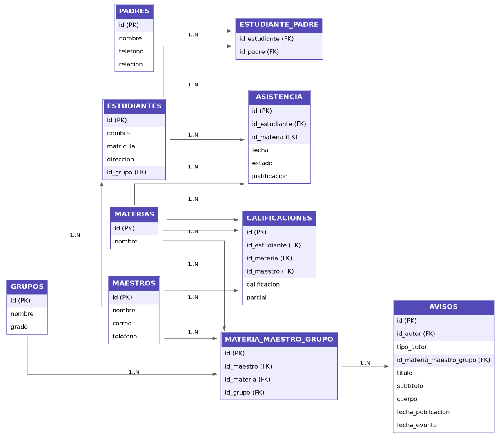

# Proyecto Quirón

> El guía que acompaña al estudiante y a su familia.

Quirón es una plataforma escolar (panel web + app móvil) que conecta a la escuela con las familias. Los maestros pasan lista, capturan calificaciones y publican avisos, y los padres, madres y tutores ven el progreso de sus hijos desde el celular.

La idea central: la app no solo muestra números. A futuro le dirá a la familia en qué destaca el estudiante, en qué puede mejorar y qué carreras podrían irle bien, sin compararlo nunca con otros compañeros.

---

## Tabla de contenido
1. [Problema que resuelve](#problema-que-resuelve)
2. [Roles y permisos](#roles-y-permisos)
3. [Funciones principales](#funciones-principales)
4. [Panel web](#panel-web)
5. [Base de datos](#base-de-datos)
6. [Stack tecnológico](#stack-tecnológico)
7. [Estructura del repositorio](#estructura-del-repositorio)
8. [Cómo ejecutar el proyecto](#cómo-ejecutar-el-proyecto)
9. [Configuración](#configuración)
10. [Escuelas que califican de 0 a 100](#escuelas-que-califican-de-0-a-100)
11. [API](#api)
12. [Roadmap](#roadmap)
13. [Decisiones de diseño](#decisiones-de-diseño)
14. [Consideraciones de escalabilidad](#consideraciones-de-escalabilidad)
15. [Estado actual](#estado-actual)
16. [Autor](#autor)

---

## Problema que resuelve
En muchas escuelas la información del estudiante (asistencia, calificaciones, avisos) llega tarde a los padres o por medios dispersos. Quirón centraliza todo en un solo sistema: el maestro registra una vez y la familia lo ve de inmediato.

## Roles y permisos

| Acción | Director | Maestro | Estudiante | Padre/Tutor |
|---|---|---|---|---|
| Dar de alta y baja a maestros y alumnos | Sí | No | No | No |
| Ver información de toda la escuela | Sí | No | No | No |
| Pasar lista y capturar calificaciones | No | Sí (solo sus grupos y materias) | No | No |
| Publicar avisos | Sí (generales) | Sí (solo su grupo y materia) | No | No |
| Ver calificaciones y asistencia | Sí (todos) | Sí (solo su grupo) | Solo las propias | Solo las de sus hijos |
| Comparar entre estudiantes o hijos | No aplica | No aplica | No | No (decisión de producto) |

Los permisos se validan en el servidor, no solo en la interfaz. Las reglas de acceso viven en un solo módulo (`backend/src/auth/permisos.ts`), y cualquier rol sin una regla definida no ve nada.

## Funciones principales
- **Pase de lista por grupo:** presente, retardo o ausente, con justificación opcional. Se puede corregir un día anterior.
- **Calificaciones por parcial.** El estado aprobado/reprobado se calcula al consultar, no se guarda.
- **Avisos** generales del Director, o por grupo y materia de cada maestro, con fecha de evento opcional.
- **Altas y bajas:** el Director da de alta a estudiantes y maestros, y puede darlos de baja o reactivarlos sin perder su historial. La baja surte efecto al instante.
- **Código familiar:** cada estudiante recibe un código que su familia usará para vincularse desde la app (el código ya se genera; la vinculación llega con la app móvil).
- **App para familias** con un menú por hijo (Hijo 1, Hijo 2) y sin comparaciones (en construcción).
- **Notificaciones push**, incluyendo alertas urgentes con sonido distinto (planeado).

## Panel web
El panel es solo para el Director y los maestros. Las familias y los estudiantes usarán la app móvil.

| Rol | Pantalla | Qué hace |
|---|---|---|
| Director | Estudiantes | Lista, alta con código familiar, baja y reactivación |
| Director | Maestros | Lista, alta, baja y reactivación |
| Director | Grupos y materias | Catálogos de la escuela |
| Director | Asignaciones | Qué maestro da qué materia a qué grupo: asignar y quitar |
| Director | Avisos | Todos los avisos; publica avisos para toda la escuela |
| Maestro | Mis grupos | Materias y grupos que tiene asignados |
| Maestro | Pasar lista | Todo el grupo en una pantalla, por fecha; todos empiezan como presentes |
| Maestro | Calificaciones | Captura por parcial, con aprobado/no aprobado mientras se escribe |
| Maestro | Avisos | Avisos generales y propios; publica en sus grupos |

Cada rol solo tiene registradas sus propias pantallas, y la sesión se cierra sola si el token vence o si la cuenta se da de baja.

## Base de datos
Diseño relacional de 11 tablas en PostgreSQL. Las relaciones de muchos a muchos se resuelven con tablas intermedias y los datos de acceso viven en una sola tabla (`Usuarios`).



| Tabla | Propósito |
|---|---|
| `Usuarios` | Correo, contraseña cifrada, rol y estado (activo) de todas las personas |
| `Estudiantes` | Datos del alumno, su grupo y su código familiar |
| `Padres` | Padres, madres y tutores |
| `Estudiante_Padre` | Vincula alumnos con sus tutores y guarda la relación (padre, madre o tutor) |
| `Maestros` | Datos del personal docente |
| `Materias` | Catálogo de materias |
| `Grupos` | Grupos y grados |
| `Materia_Maestro_Grupo` | Qué maestro da qué materia a qué grupo |
| `Asistencia` | Registro por estudiante, materia y fecha |
| `Calificaciones` | Nota por estudiante, materia, maestro y parcial |
| `Avisos` | Comunicados generales o por grupo |

El esquema completo está en [`backend/db/schema.sql`](backend/db/schema.sql).

## Stack tecnológico

| Capa | Tecnología |
|---|---|
| API | Node.js 24 LTS, TypeScript, Express |
| Base de datos | PostgreSQL 18 |
| Contenedores | Docker |
| Autenticación | JWT + argon2 para cifrar contraseñas |
| Validación de datos | Zod |
| Autorización | Control de roles propio, verificado en cada ruta |
| Panel web (Director y Maestro) | React, Vite 8, Tailwind CSS 4, React Router |
| App móvil (Familias) | Flutter (en construcción) |
| Notificaciones push | Firebase Cloud Messaging (planeado) |

## Estructura del repositorio
```
proyecto-quiron/
├── backend/
│   ├── db/schema.sql         Esquema de la base de datos
│   └── src/
│       ├── auth/             Registro de familias, login, JWT, middleware y reglas de acceso
│       ├── estudiantes/      Lista, alta, baja y reactivación de estudiantes
│       ├── maestros/         Lista, alta, baja y reactivación de maestros
│       ├── materias/         Catálogo de materias
│       ├── grupos/           Catálogo de grupos
│       ├── asignaciones/     Qué maestro da qué materia a qué grupo
│       ├── asistencia/       Pase de lista por grupo y consultas
│       ├── calificaciones/   Captura por parcial y consultas
│       ├── avisos/           Publicación, consulta y borrado de avisos
│       ├── scripts/          Creación de la cuenta del Director
│       ├── app.ts            Rutas de la API
│       ├── config.ts         Lectura y validación del .env
│       ├── db.ts             Conexión a PostgreSQL
│       └── server.ts         Arranque del servidor
├── web/
│   └── src/
│       ├── componentes/      Menú lateral y piezas de formulario
│       ├── paginas/          Una pantalla por archivo (login, estudiantes, avisos, etc.)
│       ├── api.ts            Todas las llamadas a la API
│       ├── sesion.tsx        Sesión y rol del usuario
│       ├── useApi.ts         Carga de datos con estado de carga y error
│       └── App.tsx           Rutas según el rol
├── mobile/                   App para familias (Flutter)
├── docs/                     Diagrama ER y documentación
├── docker-compose.yml        PostgreSQL en Docker
├── .env.example              Variables de entorno de ejemplo
└── README.md
```

## Cómo ejecutar el proyecto
Requisitos: Docker Desktop y Node.js 24 LTS. Los comandos son para PowerShell.

**La primera vez**
1. Copia la configuración de ejemplo y cambia la contraseña de la base y el secreto JWT:
```
   Copy-Item .env.example .env
```
2. Levanta PostgreSQL:
```
   docker compose up -d
```
3. Crea las tablas:
```
   Get-Content backend\db\schema.sql -Raw -Encoding UTF8 | docker exec -i quiron-db psql -U quiron_admin -d quiron
```
4. Instala las dependencias y crea la cuenta del Director:
```
   cd backend
   npm install
   npm run crear-director -- director@escuela.mx "una-clave-segura"
   cd ..\web
   npm install
```

**Cada vez que trabajes**
1. Abre Docker Desktop y, en la raíz, ejecuta `docker compose up -d`.
2. Terminal 1 (API): `cd backend` y `npm run dev`. Queda en http://localhost:3000
3. Terminal 2 (panel): `cd web` y `npm run dev`. Queda en http://localhost:5173

**Notas**
- `npm run dev` se ejecuta dentro de `backend` o de `web`, nunca en la raíz.
- Después de cambiar el `.env`, reinicia la API (Ctrl + C y `npm run dev`).
- Quirón expone PostgreSQL en el puerto **5433** para no chocar con un PostgreSQL instalado directamente en la computadora, que suele ocupar el 5432.
- Para confirmar que la API llega a la base de datos: http://localhost:3000/salud

## Configuración
Variables del archivo `.env`. El ejemplo está en `.env.example`; el `.env` real nunca se sube a GitHub.

| Variable | Para qué sirve | Ejemplo |
|---|---|---|
| `POSTGRES_USER` | Usuario de la base de datos | `quiron_admin` |
| `POSTGRES_PASSWORD` | Contraseña de la base de datos | Una larga y propia |
| `POSTGRES_DB` | Nombre de la base de datos | `quiron` |
| `DB_HOST` | Dirección de la base para la API | `127.0.0.1` |
| `DB_PORT` | Puerto de la base en la computadora | `5433` |
| `JWT_SECRET` | Firma de los tokens de sesión | 48 caracteres al azar |
| `CALIFICACION_MINIMA` | Calificación mínima para aprobar | `6` |

`CALIFICACION_MINIMA` se puede cambiar en cualquier momento: el aprobado/reprobado se calcula al consultar, así que ningún registro guardado se modifica.

## Escuelas que califican de 0 a 100
Hoy Quirón usa la escala de **0 a 10**. Para una escuela o universidad que califique de **0 a 100** se requiere:

1. **Ampliar la columna en la base de datos** con una migración: `calificacion` pasa de `NUMERIC(4,2)` (máximo 99.99) a `NUMERIC(5,2)`, y su regla de `0 a 10` a `0 a 100`.
2. **Agregar la variable `CALIFICACION_MAXIMA`** al `.env`, con valor `10` o `100`.
3. **Validar en la API contra esa máxima** en lugar del 10 fijo, y enviarla al panel junto con la mínima.
4. **Usarla en el panel** como límite de los campos de captura.
5. **Ajustar `CALIFICACION_MINIMA` a la escala**, por ejemplo `70` en lugar de `7`.

Importante: **la escala se elige al instalar y no se cambia a mitad de ciclo**, porque las calificaciones guardadas quedan escritas en ella. Un 8.5 capturado en escala de 10 se leería como reprobatorio en escala de 100. La mínima, en cambio, sí se puede cambiar cuando se quiera.

Si Quirón llegara a atender varias escuelas con escalas distintas, la escala y la mínima se guardarían por escuela en una tabla, junto con el `id_escuela` descrito en [Consideraciones de escalabilidad](#consideraciones-de-escalabilidad).

## API
Todas las rutas, salvo `/salud`, `/auth/registro` y `/auth/login`, requieren el token en el encabezado `Authorization: Bearer <token>`. Si la cuenta se da de baja, sus peticiones responden `401` aunque el token no haya vencido.

| Método | Ruta | Quién puede | Qué hace |
|---|---|---|---|
| GET | `/salud` | Cualquiera | Confirma que la API responde y llega a la base |
| POST | `/auth/registro` | Cualquiera | Registro de familias (siempre con rol de padre) |
| POST | `/auth/login` | Cualquiera | Devuelve un token JWT y el rol |
| GET | `/estudiantes` | Director | Estudiantes activos (con `?bajas=1`, también los dados de baja) |
| POST | `/estudiantes` | Director | Alta de estudiante con código familiar |
| PATCH | `/estudiantes/:id/estado` | Director | Dar de baja o reactivar |
| GET | `/maestros` | Cualquier usuario autenticado | Lista de maestros (correo y teléfono solo para el Director) |
| POST | `/maestros` | Director | Alta de maestro |
| PATCH | `/maestros/:id/estado` | Director | Dar de baja o reactivar |
| GET | `/materias`, `/grupos` | Cualquier usuario autenticado | Catálogos |
| POST | `/materias`, `/grupos` | Director | Crea materias o grupos |
| GET | `/asignaciones` | Director | Todas las asignaciones |
| POST | `/asignaciones` | Director | Asigna maestro + materia + grupo |
| DELETE | `/asignaciones/:id` | Director | Quita una asignación (el historial se conserva) |
| GET | `/asignaciones/mias` | Maestro | Sus asignaciones |
| GET | `/asistencia/asignacion/:id?fecha=AAAA-MM-DD` | Maestro (solo sus asignaciones) | Lista del grupo con lo ya marcado ese día |
| POST | `/asistencia/lista` | Maestro (solo sus asignaciones) | Guarda el pase de lista completo en una transacción |
| POST | `/asistencia` | Maestro | Registro individual |
| GET | `/asistencia/estudiante/:id` | Estudiante propio, su familia, Director, maestros de su grupo | Historial de asistencia |
| GET | `/calificaciones/asignacion/:id?parcial=N` | Maestro (solo sus asignaciones) | Calificaciones del grupo en ese parcial |
| POST | `/calificaciones/lista` | Maestro (solo sus asignaciones) | Guarda las calificaciones del grupo en una transacción |
| POST | `/calificaciones` | Maestro | Registro individual |
| GET | `/calificaciones/estudiante/:id` | Estudiante propio, su familia, Director, maestros de su grupo | Calificaciones con aprobado/reprobado calculado |
| GET | `/avisos` | Director (todos), Maestro (generales y propios) | Avisos para el panel |
| POST | `/avisos/general` | Director | Aviso para toda la escuela |
| POST | `/avisos/grupo` | Maestro (solo sus asignaciones) | Aviso para su grupo y materia |
| DELETE | `/avisos/:id` | Director (cualquiera), Maestro (solo los suyos) | Borra un aviso |
| GET | `/avisos/estudiante/:id` | Estudiante propio, su familia, Director, maestros de su grupo | Avisos generales y de sus materias |

## Roadmap
- [x] Diseño de la base de datos (11 tablas) y diagrama ER
- [x] Definición de roles y matriz de permisos
- [x] Repositorio y estructura inicial
- [x] Base de datos en PostgreSQL con Docker
- [x] **Fase 1 — API:** autenticación, roles, estudiantes, maestros, materias, grupos, asignaciones, asistencia, calificaciones y avisos
- [x] **Fase 1 — Panel web:** login y menú por rol, estudiantes, maestros, grupos y materias, asignaciones, pase de lista, calificaciones y avisos
- [ ] **Fase 1 — API para familias:** vinculación con el código familiar y consulta de sus hijos
- [ ] **Fase 1 — App móvil para familias (Flutter):** asistencia, calificaciones y avisos de cada hijo
- [ ] **Pulido:** pruebas automatizadas, capturas del sistema y despliegue
- [ ] **Fase 1.5:** modo sin conexión (sincronización al volver el internet)
- [ ] **Fase 2:** orientación vocacional con rol de psicólogo y validación profesional de las sugerencias de carrera
- [ ] **Fase 3:** estadísticas avanzadas para el Director y notificaciones por nivel de urgencia
- [ ] **Mejora futura:** escala de calificaciones configurable (ver [Escuelas que califican de 0 a 100](#escuelas-que-califican-de-0-a-100))

## Decisiones de diseño
- **Una fila por registro de asistencia:** en vez de una columna por estado o por estudiante, para que la tabla escale sin cambios.
- **Estado calculado, no guardado:** si la escuela cambia la calificación mínima, no hay que actualizar registros viejos.
- **Mínima aprobatoria configurable:** vive en el `.env` y la API la manda al panel.
- **Sin comparaciones entre estudiantes ni entre hijos:** decisión de producto para evitar presión y burlas.
- **Datos sensibles protegidos:** las evaluaciones psicológicas (Fase 2) tendrán acceso restringido.
- **API y permisos propios:** control total de los datos, sin depender de servicios de terceros para lo esencial.
- **Reglas de acceso en un solo módulo, y negar por defecto:** si cambia quién puede ver qué, se cambia en un lugar; un rol sin regla definida no ve nada.
- **Permisos verificados en el servidor:** cada ruta de escritura vuelve a consultar la base de datos para confirmar que el maestro de verdad tiene esa asignación, en vez de confiar solo en lo que dice el token.
- **Datos de acceso centralizados:** una sola tabla `Usuarios` (correo, contraseña cifrada, rol, activo) en vez de repetirlos en cada tabla de personas.
- **Baja lógica con efecto inmediato:** dar de baja desactiva la cuenta sin borrarla, y el servidor revisa en cada petición que siga activa, así que no hay que esperar a que venza el token.
- **Registro abierto solo para familias:** el Director da de alta al personal y a los estudiantes, y nadie puede registrarse como director desde la API. La primera cuenta de Director se crea con un script desde el servidor.
- **Pase de lista y calificaciones en una sola transacción:** se guarda el grupo completo o nada, y el servidor confirma que cada estudiante pertenezca a ese grupo.
- **Todos empiezan como presentes:** en el pase de lista el maestro solo marca las excepciones.
- **Quitar una asignación conserva el historial:** la asistencia y las calificaciones no dependen de la asignación, y si ya tiene avisos publicados la base de datos impide borrarla.
- **Datos mínimos:** quien no es Director solo recibe el nombre de los maestros, no su teléfono ni su correo.
- **Código familiar impredecible y fácil de dictar:** se genera con el generador seguro de Node y sin caracteres que se confunden (0 y O, 1 e I).
- **Contraseñas cifradas con argon2:** nunca se guardan en texto plano, ni siquiera el Director puede leerlas.
- **Sesión del panel por pestaña:** se borra al cerrar la pestaña, pensando en computadoras compartidas de la escuela.
- **Fechas sin hora:** las fechas de asistencia viajan como `AAAA-MM-DD`, para que la zona horaria no las cambie de día.

## Consideraciones de escalabilidad
El diseño actual está pensado para una sola escuela con cientos de usuarios, y ya resuelve los puntos que más importan a esa escala:

- **Base de datos normalizada**, sin datos repetidos, con llaves foráneas e índices en las consultas más usadas (asistencia por fecha, avisos por destino).
- **Backend, panel web y app móvil separados**, comunicados solo por la API. Se pueden escalar por separado.
- **Pool de conexiones a PostgreSQL** (`pg.Pool`), en vez de abrir una conexión nueva por cada petición.
- **Autenticación sin estado (JWT)**: no depende de sesiones guardadas en memoria, así que puede correr en más de una instancia de la API al mismo tiempo.

Puntos que quedan fuera del alcance del MVP, pero con una solución identificada:

| Límite actual | Cuándo importa | Cómo se resolvería |
|---|---|---|
| Un solo servidor de PostgreSQL, sin réplicas | Miles de usuarios simultáneos | Réplicas de lectura o un servicio gestionado (RDS, Cloud SQL) |
| Sin caché | Consultas muy frecuentes sobre datos que casi no cambian | Redis para catálogos como materias o grupos |
| Revisión de cuenta activa en cada petición | Miles de peticiones por segundo | Guardar el estado de las cuentas en caché por unos segundos |
| Corre en una sola computadora | Uso en producción real | Desplegar en un servicio con más de una instancia (Railway, Render, un VPS) |
| Pensado para una sola escuela | Vender el sistema a varias instituciones | Agregar `id_escuela` a las tablas y a los permisos |
| Una sola escala de calificaciones por instalación | Atender escuelas con escalas distintas | Guardar la escala y la mínima por escuela, junto con `id_escuela` |
| Avisos masivos enviados en la misma petición | Un aviso a cientos de padres a la vez | Cola de trabajo (por ejemplo BullMQ) para las notificaciones push |

## Estado actual
La API y el panel web están completos y probados. El Director administra estudiantes, maestros, grupos, materias, asignaciones y avisos; el maestro pasa lista, captura calificaciones y publica avisos de sus grupos. En construcción: la API para familias y la app móvil.

### Pendientes conocidos
- **Vinculación de familias:** el código familiar ya se genera, pero falta la ruta para que una familia se vincule. Llega con la app móvil.
- **Ciclos escolares:** el sistema no distingue un ciclo de otro. Si una materia se repite en el ciclo siguiente, las calificaciones nuevas del mismo parcial reemplazarían a las anteriores. Se resuelve agregando una tabla de ciclos y ligando a ella las asignaciones y calificaciones.
- **Editar datos:** hoy solo hay alta y baja; falta cambiar a un estudiante de grupo o corregir nombres y correos.
- **Contraseñas:** falta que cada usuario pueda cambiar su contraseña y recuperarla si la olvida.
- **Pruebas automatizadas:** todo se probó a mano; faltan pruebas que se ejecuten solas.

## Autor
Felix Arvizu Angel Gabriel, DSM 4-1, Universidad Tecnológica de Hermosillo (UTH).